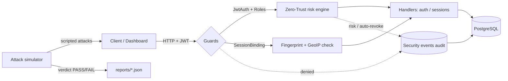

# auth-lab

A NestJS authentication backend paired with a **defensive attack simulator** and a
terminal-style SOC dashboard. The backend implements JWT access/refresh with
rotation, session binding, device fingerprinting, TOTP multi-factor auth, a
zero-trust risk engine with GeoIP / impossible-travel detection, and a
security-event audit trail. The simulator is a local harness that drives the
backend's own endpoints with scripted attack scenarios and asserts the defenses fire.

> A learning/validation lab. The simulator only speaks HTTP to the lab's own
> auth endpoints — it is a scenario runner, not a remote-exec tool.


## Architecture



See **[docs/DIAGRAMS.md](docs/DIAGRAMS.md)** for a full visual walkthrough.


## Quickstart (Docker — one command)

Requires Docker Desktop running.

```bash
docker compose up --build
```

This builds and starts three containers:

| Service | URL | What it is |
| ------- | --- | ---------- |
| `db`  | `localhost:5432` | PostgreSQL |
| `api` | `http://localhost:3000` (Swagger at `/api`) | NestJS backend |
| `web` | `http://localhost:4321` | SOC dashboard |

A ready-to-use **admin** and **victim** are seeded automatically on first boot:

- admin — `admin@test.com` / `admin12345`
- victim — `test@test.com` / `12345678`

Open **http://localhost:4321** and log in as the admin. Admins are required to
use MFA, so you'll be prompted to scan a QR (or paste a code) and enable it —
then the SOC console opens. Pick an **ATTACKER ORIGIN** and **LAUNCH ATTACK** to
watch the defenses fire: live alerts, the victim's session location, and an
`IMPOSSIBLE_TRAVEL` event when you launch from two distant countries in a row.

Stop with `Ctrl+C`, then `docker compose down`. There's no DB volume, so data
resets on the next `up` (the seeder recreates the accounts) — convenient for a demo.

> Make sure nothing else is using port 3000 (e.g. a local `pnpm start:dev`),
> or the `api` container won't be able to bind it.

### Without Docker

Needs Node 20 (API) / Node 22 (web) and a local PostgreSQL.

```bash
# backend (terminal 1)
pnpm install
cp .env.example .env            # DB connection + JWT secrets; set SEED_ON_BOOT=true
pnpm run start:dev              # http://localhost:3000

# frontend (terminal 2)
cd web && npm install && npm run dev   # http://localhost:4321
```

## Backend

| Area            | Highlights                                                        |
| --------------- | ----------------------------------------------------------------- |
| Auth            | register / login / refresh / logout / **logout-all**              |
| Tokens          | access + refresh JWTs, refresh rotation, replay (JTI) protection  |
| MFA             | TOTP enrollment (QR), per-account; **mandatory for admins**       |
| Sessions        | per-device sessions, binding guard, list & revoke                 |
| Zero-trust      | per-request risk scoring → ALLOW / STEP_UP / REVOKE               |
| GeoIP           | IP → location on each session; **impossible-travel** detection    |
| Audit           | `GET /security/events` — your own security decisions, newest first |
| RBAC            | `GET /security/events/all`, `/sessions/all`, `/attack-range/*` — **admin-only** |
| Lockout         | account locked after repeated failed logins → `ACCOUNT_LOCKED`    |
| Docs            | Swagger UI at `/api`                                              |

**Zero-trust on every request** — token + session-binding checks, a risk score, then allow / step-up / block, logging an event either way:


## Attack simulator

Run the scripted scenarios against a running backend, from the dashboard's
attack range or the CLI.

```bash
pnpm sim                          # interactive console
pnpm sim --all                    # run every scenario, non-interactive
pnpm sim --scenario token-reuse,refresh-race
pnpm sim --all --target http://localhost:3000 --out reports/run.json
```

Scenarios: `refresh-race`, `token-reuse`, `session-hijack`, `fingerprint-spoof`, `brute-force`, `jwt-tamper`.

### Defense verdict (CI-friendly)

Each scenario declares the defensive behaviour the backend should exhibit. After
a run the simulator prints a PASS/FAIL verdict per scenario, and **non-interactive
runs exit non-zero if any defense failed to fire** — so `pnpm sim --all` can be
wired into CI as a regression test for the auth stack. Runs also emit a
schema-validated JSON report (`--out`).

## Tests

```bash
pnpm test         # unit tests (incl. simulator SOC logic + verdict evaluator)
pnpm test:cov     # with coverage
pnpm test:e2e     # end-to-end
```

## Layout

```
src/
  modules/            # auth, users, sessions, security (audit), seed, attack-range
  attack-simulator/
    schemas.ts        # Zod schemas — single source of truth for sim types
    registry.ts       # scenarios + their defensive expectations
    runner.ts         # orchestrates a run, builds + prints the report
    cli.ts            # interactive console (`pnpm sim`)
    engine/           # event bus, rule engine, correlation, report builder
    scenarios/        # the attack scripts
web/                  # Astro SOC dashboard
docs/                 # DIAGRAMS.md + SCHEMAS.md + diagrams/
```
