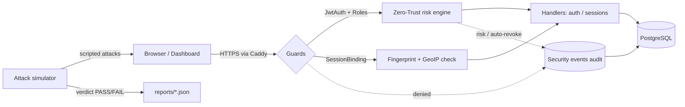
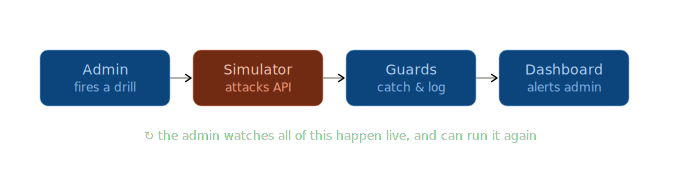
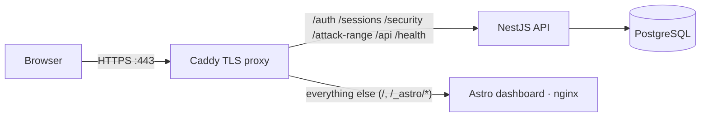
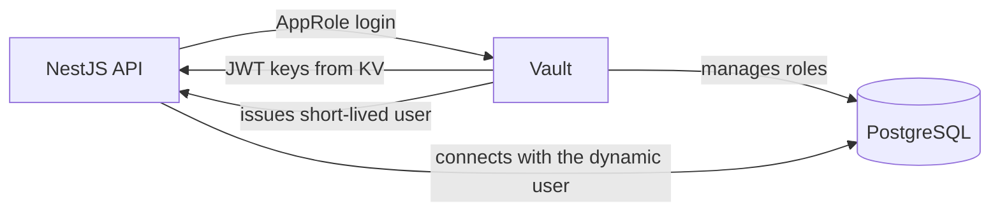
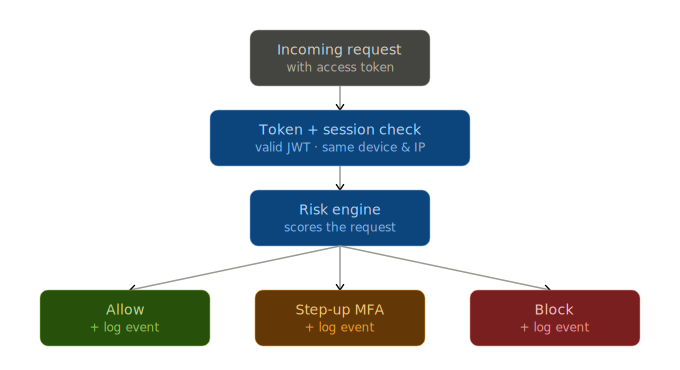

# auth-lab

A NestJS authentication backend paired with a **defensive attack simulator** and a
terminal-style SOC dashboard, served behind a **TLS reverse proxy on a single
HTTPS origin**. The backend implements JWT access/refresh with rotation, session
binding, device fingerprinting, TOTP multi-factor auth, a zero-trust risk engine
with GeoIP / impossible-travel detection, and a security-event audit trail. The
simulator is a local harness that drives the backend's own endpoints with
scripted attack scenarios and asserts the defenses fire.

> A learning/validation lab. The simulator only speaks HTTP to the lab's own
> auth endpoints — it is a scenario runner, not a remote-exec tool.


## Architecture



See **[docs/DIAGRAMS.md](docs/DIAGRAMS.md)** for a full visual walkthrough.



## Deployment topology

Everything sits behind **Caddy**, which terminates TLS and is the only exposed
service. The browser talks to one HTTPS origin; Caddy routes API paths to the
backend and everything else to the dashboard. Because the dashboard and API
share that origin, the browser makes **no cross-origin calls** at all.



| Path on `https://localhost` | Goes to |
| --------------------------- | ------- |
| `/auth/*`, `/sessions*`, `/security/*`, `/attack-range/*`, `/api` (Swagger), `/health` | NestJS API |
| everything else (`/`, `/_astro/*`, assets) | Astro dashboard |

## Quickstart (Docker — one command)

Requires Docker Desktop running.

```bash
docker compose up --build
```

This builds and starts four containers:

| Service | Exposed at | What it is |
| ------- | ---------- | ---------- |
| `caddy` | **`https://localhost`** (port 80 redirects to 443) | TLS reverse proxy — the only entry point |
| `web`   | internal only | Astro SOC dashboard (nginx) |
| `api`   | internal only — Swagger at `https://localhost/api` | NestJS backend |
| `db`    | `localhost:5433` | PostgreSQL (dev convenience) |

A ready-to-use **admin** and **victim** are seeded automatically on first boot:

- admin — `admin@test.com` / `admin12345`
- victim — `test@test.com` / `12345678`

Open **https://localhost** and log in as the admin.

> **Certificate warning is expected.** For local use Caddy mints its own
> certificate from an internal CA your browser doesn't trust, so you'll get a
> one-time warning — click through ("proceed to localhost"). HSTS is off for the
> local cert specifically so this stays bypassable. To remove the warning you can
> trust Caddy's root CA, but it isn't needed for a demo.

Admins are required to use MFA, so you'll be prompted to scan a QR (or paste a
code) and enable it — then the SOC console opens. Pick an **ATTACKER ORIGIN** and
**LAUNCH ATTACK** to watch the defenses fire: live alerts, the victim's session
location, and an `IMPOSSIBLE_TRAVEL` event when you launch from two distant
countries in a row.

Stop with `Ctrl+C`, then `docker compose down`. There's no DB volume, so data
resets on the next `up` (the seeder recreates the accounts) — convenient for a demo.

### Without Docker

Needs Node 20 (API) / Node 22 (web) and a local PostgreSQL.

```bash
# backend (terminal 1)
pnpm install
cp .env.example .env            # DB connection + JWT secrets; set SEED_ON_BOOT=true
pnpm run start:dev              # http://localhost:3000

# frontend (terminal 2) — point it at the local API, since same-origin is the
# Docker/Caddy default
cd web && npm install
PUBLIC_API_URL=http://localhost:3000 npm run dev   # http://localhost:4321
```

> On Windows PowerShell, set the env var first:
> `$env:PUBLIC_API_URL="http://localhost:3000"; npm run dev`

## Transport security & hardening

| Layer | What's in place |
| ----- | --------------- |
| **TLS** | Caddy terminates HTTPS at the edge; the app containers speak plain HTTP only on the internal Docker network. |
| **Single origin** | Dashboard + API share `https://localhost`, so the browser makes no cross-origin requests (CORS is moot in normal use). |
| **Security headers** | `X-Content-Type-Options: nosniff`, `X-Frame-Options: DENY`, `Referrer-Policy: no-referrer`, and `X-Powered-By` removed. |
| **HSTS** | Sent only when `ENABLE_HSTS=true`. It's **off by default** because pinning HSTS against the local self-signed cert would make the browser's certificate warning non-bypassable and lock you out. |
| **CORS** | Locked to an allowlist (`CORS_ORIGINS`, comma-separated) instead of reflecting any origin. |
| **Secrets** | Optional [Vault layer](#secrets-management-hashicorp-vault): JWT keys + short-lived DB credentials issued at boot instead of living in the compose file. |

**Going to a real domain** is a small switch:

1. In `Caddyfile`, replace `localhost` with your domain and delete the
   `tls internal` line — Caddy then auto-provisions and renews a Let's Encrypt
   certificate.
2. Add the HSTS header back to the Caddy site block.
3. Set `ENABLE_HSTS=true` and `CORS_ORIGINS=https://your-domain` on the `api`
   service.

## Secrets management (HashiCorp Vault)

An **opt-in** layer that puts secrets behind Vault instead of the compose file.
It's off by default — your normal `docker compose up` is untouched — and enabled
with an overlay (no host install of Vault needed; it runs as a container):

```bash
docker compose -f docker-compose.yml -f docker-compose.vault.yml up --build
```

**Phase 1 — static secrets.** At boot the API authenticates to Vault with
**AppRole** (a least-privilege, read-only identity) and pulls the JWT signing
keys from a KV v2 store, injecting them into the environment before Nest starts.
The keys are generated *inside* Vault and never appear in the repo.

**Phase 2 — dynamic database credentials.** With `USE_VAULT_DB=true` the API
requests a **short-lived PostgreSQL user** from Vault's database secrets engine
at boot, instead of using a static password, and a background renewer keeps the
lease alive for the life of the process. Because the lab keeps no DB volume,
each `up` gets a fresh dynamic user that creates and owns its own tables — so
there's no cross-user ownership problem to manage.



Inspect what Vault issued:

```bash
docker compose -f docker-compose.yml -f docker-compose.vault.yml \
  exec vault vault read database/creds/auth-lab
```

Left for a real deployment: when a credential reaches its `max_ttl`, a
production app fetches a new one and recreates its DB pool. That
rotation-with-reconnect step needs a live environment to get right and is out of
scope here — the renewer covers the in-lifetime case.

## Backend

| Area            | Highlights                                                        |
| --------------- | ----------------------------------------------------------------- |
| Auth            | register / login / refresh / logout / **logout-all**              |
| Tokens          | access + refresh JWTs, refresh rotation, replay (JTI) protection  |
| MFA             | TOTP enrollment (QR), per-account; **mandatory for admins**       |
| Sessions        | per-device sessions, binding guard, list & revoke                 |
| Zero-trust      | per-request risk scoring → ALLOW / STEP_UP / REVOKE               |
| GeoIP           | IP → location on each session; **impossible-travel** detection    |
| Audit           | `GET /security/events` — your own security decisions, newest first |
| RBAC            | `GET /security/events/all`, `/sessions/all`, `/attack-range/*` — **admin-only** |
| Lockout         | account locked after repeated failed logins → `ACCOUNT_LOCKED`    |
| Hardening       | security headers, CORS allowlist, behind a TLS proxy (see above)  |
| Docs            | Swagger UI at `/api`                                              |

**Zero-trust on every request** — token + session-binding checks, a risk score, then allow / step-up / block, logging an event either way:



## Attack simulator

Run the scripted scenarios against a running backend, from the dashboard's
attack range or the CLI.

```bash
pnpm sim                          # interactive console
pnpm sim --all                    # run every scenario, non-interactive
pnpm sim --scenario token-reuse,refresh-race
pnpm sim --all --target http://localhost:3000 --out reports/run.json
```

Scenarios: `refresh-race`, `token-reuse`, `session-hijack`, `fingerprint-spoof`, `brute-force`, `jwt-tamper`.

> When launched from the dashboard, the simulator runs in-process inside the
> `api` container and targets the API locally (`http://127.0.0.1:3000`), not the
> public HTTPS origin — override with `SIM_TARGET` if needed.

### Defense verdict (CI-friendly)

Each scenario declares the defensive behaviour the backend should exhibit. After
a run the simulator prints a PASS/FAIL verdict per scenario, and **non-interactive
runs exit non-zero if any defense failed to fire** — so `pnpm sim --all` can be
wired into CI as a regression test for the auth stack. Runs also emit a
schema-validated JSON report (`--out`).

## Tests

```bash
pnpm test         # unit tests (incl. simulator SOC logic + verdict evaluator)
pnpm test:cov     # with coverage
pnpm test:e2e     # end-to-end
```

## Layout

```
Caddyfile             # TLS edge: terminates HTTPS, routes API vs dashboard
docker-compose.yml    # db + api + web + caddy
docker-compose.vault.yml  # opt-in Vault overlay (secrets + dynamic DB creds)
vault/init.sh         # Vault bootstrap (AppRole, KV, DB secrets engine)
src/
  modules/            # auth, users, sessions, security (audit), seed, attack-range
  attack-simulator/
    schemas.ts        # Zod schemas — single source of truth for sim types
    registry.ts       # scenarios + their defensive expectations
    runner.ts         # orchestrates a run, builds + prints the report
    cli.ts            # interactive console (`pnpm sim`)
    engine/           # event bus, rule engine, correlation, report builder
    scenarios/        # the attack scripts
web/                  # Astro SOC dashboard
  src/
    layouts/          # Layout.astro (shell, fonts, global styles)
    components/        # 9 panels: TopBar, LoginPanel, SessionsTable, EventFeed, …
    services/api.ts   # all network calls: base URL, token storage, auto-refresh
    lib/              # dom.ts, format.ts, dashboard.ts (UI behaviour)
# (backend) src/vault/  # boot-time Vault loader (AppRole, KV, dynamic DB creds)
    styles/global.css # Tailwind v4 + terminal theme
docs/                 # DIAGRAMS.md + SCHEMAS.md + diagrams/
```
