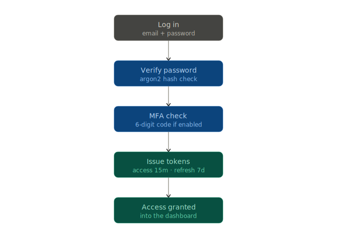
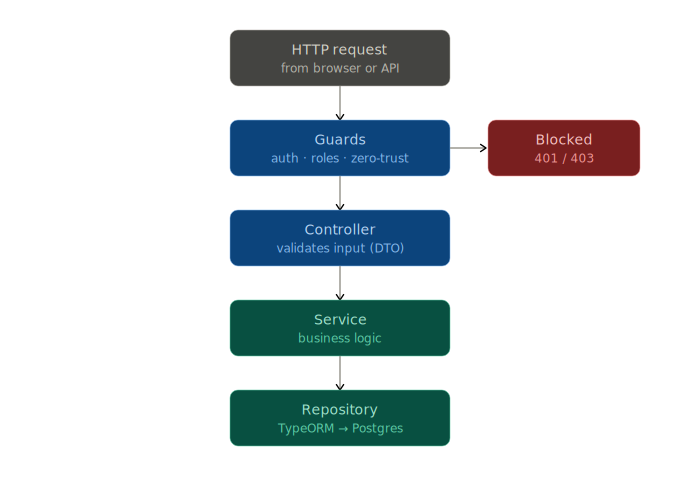
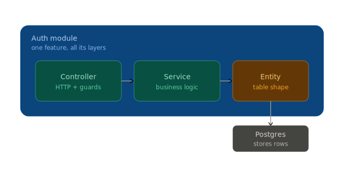
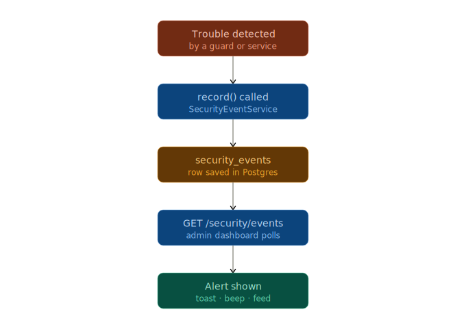
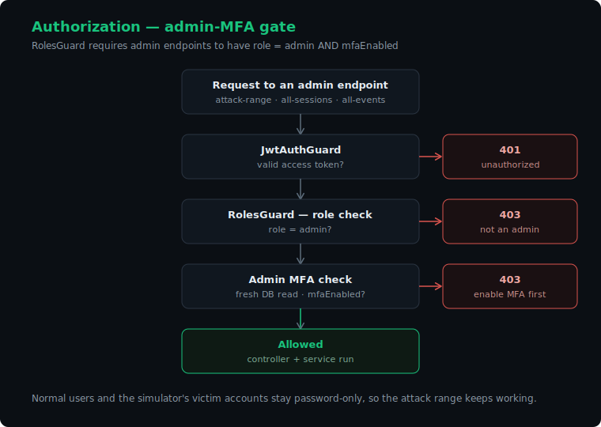
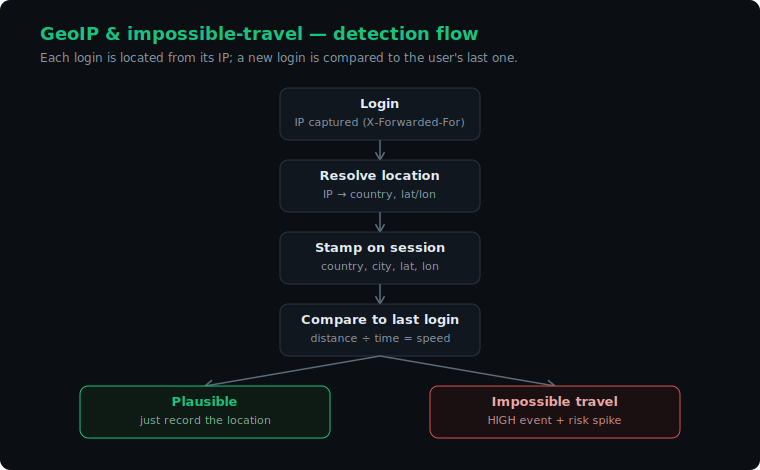
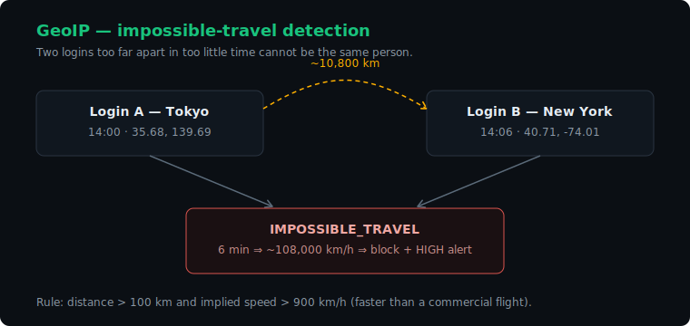
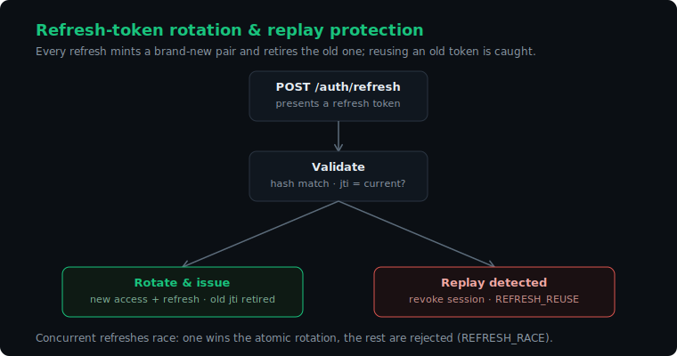

# auth-lab — diagrams

Visual walkthrough of how the system works, from logging in to catching an attack.

## Demo

---

## 1. Logging in & the roles

**Who's who.** The admin is the SOC analyst (sees everything, fires drills); normal users are the protected population; the attacker is the simulator, never a real user.

**Login flow.** Email + password → argon2 verify → optional MFA code → a 15-minute access token and a 7-day refresh token.

**How an attack becomes an alert.** The admin fires a drill, the simulator hammers the API, the guards catch it and log events, and the dashboard surfaces them live.

## 2. Request pipeline

**The layers.** Every request passes guards (which can reject it) → controller → service → repository → Postgres.

**One module.** Each feature bundles its controller, service, and entity.

**Zero-trust on every request.** Token + session-binding checks, then a risk score → allow / step-up / block, logging an event either way.

**Security-event lifecycle.** From detection → `record()` → the `security_events` table → the dashboard feed.

## 3. Admin-MFA gate

Admin accounts can see everything and fire attacks, so they're required to enable MFA before any admin endpoint will answer.

## 4. GeoIP & impossible travel

**Detection flow.** Each login's IP is resolved to a location, stored on the session, and compared to the previous login.

**Worked example.** Two logins too far apart in too little time trip the rule.

## 5. Refresh-token rotation & replay protection

Every refresh mints a new pair and retires the old token; reusing an old one is caught as a replay.

